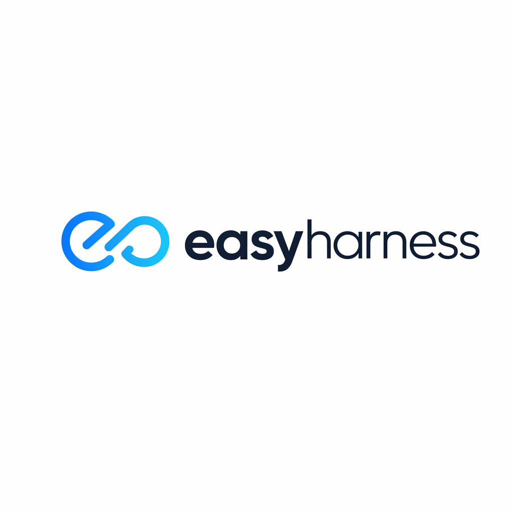

<p align="center">
  
</p>

# EasyHarness

**Automated development harness for AI coding agents.** From requirements to verified implementation — with a calibrated evaluator that catches shortcuts.

EasyHarness is a set of three agent skills that form a pipeline: **plan** your work, **develop** with a RALPH loop, and **evaluate** every step with a skeptical 4-layer verification engine. The agent writes the code; a separate evaluator agent verifies it against a machine-readable contract. No self-grading.

## Philosophy

Most AI coding workflows have a trust problem: the same agent that writes the code also decides whether it's done. It's like grading your own homework. EasyHarness splits the roles.

### Generator-Evaluator Separation

Inspired by [Anthropic's harness research](https://www.anthropic.com/engineering/swe-bench-sonnet), EasyHarness enforces a hard boundary:

- **Generator** (you, the agent) — full access: read, write, edit, terminal. Implements code.
- **Evaluator** (dispatched subagent) — read-only + terminal. Runs tests, reads code, checks contracts. **Cannot edit files.**

The evaluator's job is to find problems, not validate success. Its prompt includes anti-self-persuasion guardrails: "If you lean toward PASS, think again — the generator may be cutting corners."

### Contract-Driven Development

Borrowed from Anthropic's contract negotiation pattern: before any code is written, `easyharness-plan` generates a **machine-verifiable contract** — a set of acceptance criteria (ACs) that can be checked by reading code and running tests, with zero human judgment required.

Bad AC: *"Works correctly"* — what does "correctly" mean?
Good AC: *"POST /api/users returns 400 with `{ error: 'Email required' }` when email is empty string"*

### RALPH Loop with Evaluator Feedback

The development cycle follows a RALPH loop (Reason → Act → Learn → Plan → Hypothesize), adapted from Anthropic's iterative harness pattern:

1. Implement one task using TDD
2. Dispatch the evaluator
3. If FAIL → parse feedback, fix, retry (up to 3 attempts)
4. If same AC fails twice → propose contract amendment (AC may be flawed)
5. If still failing → BLOCKED, escalate to human

This is not "run tests and hope." The evaluator checks 4 layers: hard checks (tests/lint/build), stub detection, contract compliance line-by-line (including architectural constraints), and quality scoring with hard thresholds.

### Standing on Shoulders

EasyHarness combines practices from four sources:

| Source | What we took |
|--------|-------------|
| [Anthropic's harness article](https://www.anthropic.com/engineering/swe-bench-sonnet) | Generator/evaluator split, contract negotiation, calibrated few-shot evaluator, anti-self-persuasion, RALPH loop |
| [OpenAI's harness engineering](https://openai.com/index/harness-engineering/) | Repo-as-record-system (persistent learnings), contract amendment (docs rot), architectural constraint enforcement (invariants > micromanagement) |
| [superpowers](https://github.com/obra/superpowers) | Brainstorming-style requirement exploration, writing-plans task decomposition, TDD discipline, verification-before-completion |
| [gstack](https://github.com/garrytan/gstack) | Browser-based QA for UI acceptance criteria, headless verification of visual behaviors |

## Skills Overview

```
easyharness-plan        Requirements → Design → Tasks → Contract
        ↓
easyharness-develop     RALPH loop: implement → evaluate → retry → next task
        ↓
easyharness-evaluator   4-layer verification (dispatched as read-only subagent)
```

### easyharness-plan

Turns vague requirements into two artifacts:
- `plan.md` — implementation plan with bite-sized tasks, file paths, and complexity tags
- `contract.md` — per-task acceptance criteria, test requirements, and regression guards

### easyharness-develop

Orchestrates implementation task-by-task. You (the agent) ARE the generator — you write the code directly using TDD. After each task, you dispatch `easyharness-evaluator` as a read-only subagent. If it returns FAIL, you incorporate its feedback and retry.

### easyharness-evaluator

A skeptical 4-layer verification engine:

1. **Layer 1 — Hard Checks**: Tests, lint, build, regression. Pure exit codes, no LLM judgment. Any failure = immediate FAIL.
2. **Layer 2 — Stub Detection**: Grep + LLM scan for TODOs, hardcoded values, empty catch blocks, mock-only tests.
3. **Layer 3 — Contract Compliance**: Line-by-line AC verification. Reads the actual code — does not trust the generator's self-report.
4. **Layer 4 — Quality Scoring**: Functionality (>=8), regression (>=9), code quality (>=6), test coverage (PASS/FAIL).

## Installation

### 1. Install EasyHarness skills

```bash
# Clone into your agent's skills directory

# Claude Code
git clone https://github.com/anthropic-skills/easyharness.git ~/.claude/skills/easyharness

# OpenCode
git clone https://github.com/anthropic-skills/easyharness.git ~/.agents/skills/easyharness

# Cursor
git clone https://github.com/anthropic-skills/easyharness.git ~/.cursor/skills/easyharness
```

### 2. Install dependencies

**Required — [superpowers](https://github.com/obra/superpowers):**

| Platform | Command |
|----------|---------|
| Claude Code | Tell your agent: `Fetch and follow instructions from https://raw.githubusercontent.com/obra/superpowers/refs/heads/main/INSTALL.md` |
| OpenCode | Tell your agent: `Fetch and follow instructions from https://raw.githubusercontent.com/obra/superpowers/refs/heads/main/.opencode/INSTALL.md` |

**Optional — [gstack](https://github.com/garrytan/gstack) (for UI projects):**

```bash
# Only needed if your contract has visual/UI acceptance criteria
git clone --single-branch --depth 1 https://github.com/garrytan/gstack.git ~/.claude/skills/gstack
cd ~/.claude/skills/gstack && ./setup
```

### 3. Verify

Ask your agent:
```
List available skills matching 'easyharness'
```

You should see: `easyharness-plan`, `easyharness-develop`, `easyharness-evaluator`.

## Usage

### Quick Start: Full Pipeline

```
You: "I need a REST API for user registration with email validation and password hashing."

Agent loads easyharness-plan →
  - Asks clarifying questions (one at a time, multiple choice)
  - Proposes 2-3 approaches with trade-offs
  - Decomposes into tasks with file paths
  - Generates contract with machine-verifiable ACs
  - Saves plan.md + contract.md

You: "Looks good. Start implementation."

Agent loads easyharness-develop →
  - Reads plan.md + contract.md
  - Creates todo list (one per task)
  - For each task:
    - REASON: reads task + contract
    - ACT: implements with TDD
    - EVALUATE: dispatches easyharness-evaluator (read-only)
    - On PASS → commits, marks done, moves to next
    - On FAIL → parses feedback, fixes, retries
  - Final evaluation across all tasks
  - Reports completion
```

### Sample 1: Planning Phase

Tell your agent:

```
Use easyharness-plan. I want to add a markdown-to-HTML converter
to my CLI tool. It should support headings, bold, italic, links,
and code blocks. Output to stdout by default, --output flag for file.
```

The agent will:
1. Explore your project structure
2. Ask: *"Should malformed markdown produce an error or best-effort output?"*
3. Ask: *"Do you want streaming output for large files, or buffer-then-write?"*
4. Propose approaches (regex-based vs parser-combinator vs use `marked` library)
5. Decompose into tasks:
   - Task 1: CLI argument parsing (`--output` flag)
   - Task 2: Markdown parser core (headings, bold, italic)
   - Task 3: Link and code block support
   - Task 4: Output routing (stdout vs file)
6. Generate contract:
   ```
   ## Task 2: Markdown Parser Core
   ### Acceptance Criteria
   - [ ] AC-2.1: `# Hello` converts to `<h1>Hello</h1>`
   - [ ] AC-2.2: `**bold**` converts to `<strong>bold</strong>`
   - [ ] AC-2.3: `*italic*` converts to `<em>italic</em>`
   - [ ] AC-2.4: Nested formatting `**bold *and italic***` produces `<strong>bold <em>and italic</em></strong>`
   - [ ] AC-2.5: Plain text without markdown syntax passes through unchanged
   ### Test Requirements
   - Unit tests for each AC with exact input/output pairs
   - Edge case: empty string input returns empty string
   ### Regression Guard
   - Existing CLI tests must continue passing
   ```

### Sample 2: Development with Evaluator Feedback

After planning, tell your agent:

```
Use easyharness-develop. Execute the plan at docs/plans/2026-04-22-markdown-converter.md
with contract docs/plans/2026-04-22-markdown-converter-contract.md
```

The agent implements Task 2 using TDD, then dispatches the evaluator. The evaluator returns:

```json
{
  "verdict": "FAIL",
  "layer_results": {
    "automated_checks": { "tests": { "status": "passed" } },
    "stub_detection": { "status": "found", "findings": [
      "parser.ts:34 — hardcoded regex for headings only handles h1, contract implies h1-h6"
    ]},
    "contract_compliance": {
      "AC-2.1": { "status": "PASS", "evidence": "test at parser.test.ts:12" },
      "AC-2.4": { "status": "FAIL", "reason": "Nested bold+italic produces <strong>bold *and italic*</strong> — inner italic not converted" }
    }
  },
  "feedback": "Fix nested formatting in parser.ts:40 — the bold regex consumes the inner asterisks before italic regex runs. Process italic BEFORE bold, or use a recursive descent approach.",
  "blocking_issues": ["AC-2.4: nested formatting broken"]
}
```

The agent reads the feedback, fixes the parsing order, re-runs TDD, and dispatches the evaluator again. This time: PASS.

### Sample 3: Standalone Evaluation

You can use the evaluator independently — after any implementation, not just within the RALPH loop:

```
Use easyharness-evaluator to verify the auth module against this contract:

## Auth Module
### Acceptance Criteria
- [ ] AC-1: POST /login with valid credentials returns 200 + JWT token
- [ ] AC-2: POST /login with invalid password returns 401
- [ ] AC-3: JWT token expires after 1 hour (configurable via AUTH_TOKEN_TTL env var)
- [ ] AC-4: Protected routes return 403 when token is missing
- [ ] AC-5: Protected routes return 401 when token is expired
```

The evaluator will run all 4 layers against your current code and return a structured verdict.

### Sample 4: Resuming After Interruption

EasyHarness-develop marks completed tasks in `plan.md` with `✅ DONE`. If a session dies:

```
Use easyharness-develop. Resume the plan at docs/plans/2026-04-22-markdown-converter.md
```

The agent reads the plan, sees Tasks 1-2 marked DONE, runs a quick smoke test on them, and continues from Task 3.

## How the Evaluator Stays Honest

The evaluator includes calibration examples (`few-shot-examples.md`) showing:

- **PASS example** — clean `validateEmail` implementation. All layers green, every AC has code + test evidence.
- **FAIL example (subtle)** — `processPayment` that passes all tests but uses a hardcoded exchange rate instead of the live API call the contract required. Layer 2 catches the hardcoded value; Layer 3 catches the AC violation.
- **FAIL example (over-engineering)** — contract asked for a simple file logger, generator built a full logging framework with rotation, compression, and remote shipping. ACs technically met, but flagged for excessive complexity.

These examples calibrate the evaluator's judgment: PASS means genuinely good, not "close enough."

## Project Structure

```
easyharness/
├── skills/
│   ├── easyharness-plan/
│   │   └── SKILL.md                      # Requirements → contract pipeline
│   ├── easyharness-develop/
│   │   ├── SKILL.md                      # RALPH loop orchestration
│   │   └── evaluator-dispatch-prompt.md  # Template for dispatching evaluator
│   └── easyharness-evaluator/
│       ├── SKILL.md                      # 4-layer verification engine
│       └── few-shot-examples.md          # Calibration examples (PASS/FAIL)
└── docs/
    └── plans/                            # Generated plans and contracts live here
```

## FAQ

**Q: Does this only work with Claude Code?**
No. EasyHarness skills are plain markdown files following the [agentskills.io](https://agentskills.io) spec. They work with any agent that supports skill loading — Claude Code, OpenCode, Cursor, Codex CLI.

**Q: Can I use easyharness-develop without easyharness-plan?**
Yes. Write your own `plan.md` and `contract.md` by hand, following the format in the skill docs. The develop skill just needs those two files as input.

**Q: What if the evaluator is wrong?**
The evaluator can be wrong — it's an LLM too. If the same AC fails twice, `easyharness-develop` will pause and propose a **contract amendment** — maybe the AC itself is flawed, not the implementation. After 3 total retries, the task is marked BLOCKED and escalated to you. You can override the evaluator, amend the contract, or manually fix the issue.

**Q: How is this different from just running tests?**
Tests are Layer 1. The evaluator also catches stubs/shortcuts (Layer 2), checks whether the code actually matches the contract's intent including architectural constraints (Layer 3), and scores overall quality (Layer 4). A test suite that passes against mocks but doesn't implement the real behavior will fail Layer 3.

**Q: What happens if my session dies mid-implementation?**
EasyHarness is designed for crash recovery. Completed tasks are marked `✅ DONE` in `plan.md` on disk. Cross-task learnings are persisted to `docs/learnings.md`. On resume, the agent reads both files, smoke-tests completed work, and continues from the first incomplete task — no context loss.

**Q: Can I customize retry limits or quality thresholds?**
Yes. Retry limits are noted in the contract metadata (default: 3). Quality thresholds are defined in the evaluator skill and can be adjusted per project.

## License

MIT
