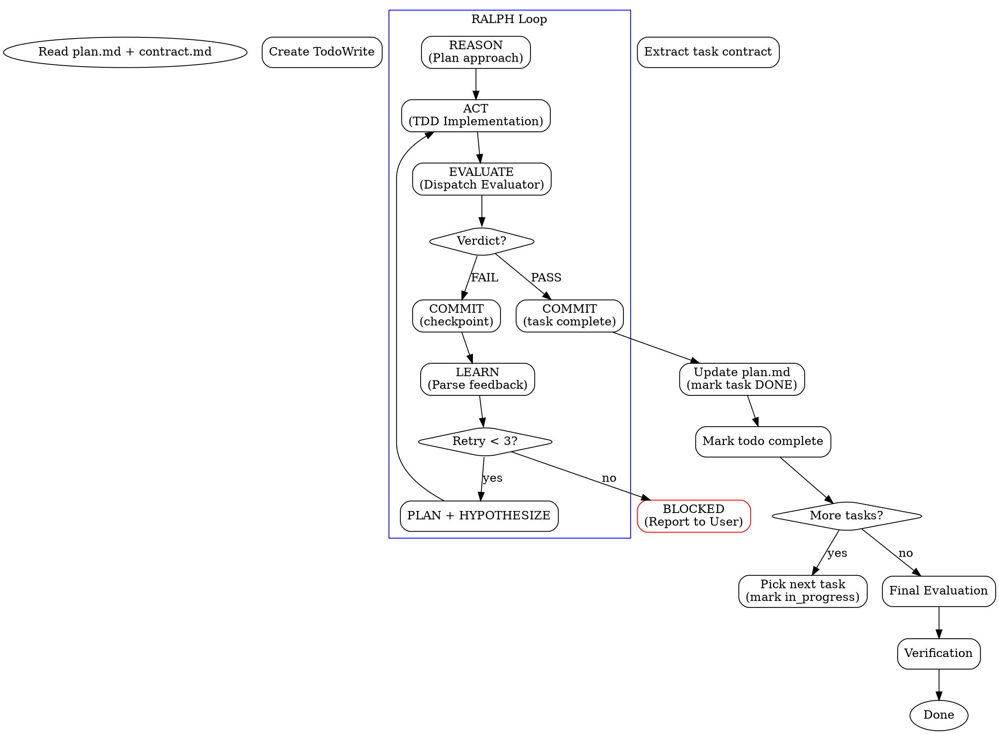

# EasyHarness-Develop: RALPH Loop Orchestration

## Overview
- Execute a plan + contract by iterating through tasks with automated evaluation.
- Core principle: Implement one task at a time. After each, dispatch evaluator. If FAIL, incorporate feedback and retry. Never move to next task until current passes.
- **You ARE the generator** — implement code directly, no subagent for implementation. Only evaluator is dispatched as read-only subagent.
- **RALPH = Reason → Act → Learn → Plan → Hypothesize**
    - **Reason**: Read task, understand needs, check dependencies.
    - **Act**: Implement following TDD.
    - **Learn**: Receive evaluator feedback, understand what went wrong.
    - **Plan**: Decide what to change.
    - **Hypothesize**: If stuck after 2 failures, consider whether approach is wrong.

## Prerequisites
- Required: superpowers (test-driven-development, verification-before-completion)
- Required: easyharness-evaluator (dispatched as read-only subagent)
- Optional: gstack browse (if UI project needs browser QA in evaluator)
- Install links: https://github.com/obra/superpowers, https://github.com/garrytan/gstack

## Process Flow


## Setup
1. **Read plan.md**: Extract all tasks, file structure, and context. Check for tasks already marked ✅ DONE — skip those.
2. **Read contract.md**: Extract per-task ACs, test requirements, and regression guards.
3. **Read learnings**: If `docs/learnings.md` exists, read it. These are durable cross-task learnings from previous sessions.
4. **Create TodoWrite**: One todo per task from the plan. Pre-mark DONE tasks as `completed`.
5. **Verify dependencies**: Ensure test runner, linter, and build tools exist and are functional.
6. **Record baseline**: Run existing tests (count + status) and check lint status.
7. **Session recovery**: If resuming (some tasks marked DONE in plan.md), verify DONE tasks still pass (quick smoke test), then continue from first incomplete task. Learnings from prior sessions are already on disk — no context loss.

## Per-Task RALPH Loop

### REASON (Before Coding)
- Read task description from `plan.md`.
- Read task's contract from `contract.md` (ACs, test reqs, regression guards).
- Check dependencies — ensure all prerequisite tasks are complete.
- If retry: Read previous evaluator feedback carefully.
- Plan approach in 2-3 sentences.

### ACT (Implementation)
Follow TDD strictly (using `superpowers:test-driven-development`):
- Write failing test for the first AC → verify it fails → write minimal code → verify it passes.
- Repeat for all remaining ACs.
- Run full test suite (ensure no regressions) + lint + build.
- If retry: Focus on specific evaluator feedback; do not rewrite everything unless hypothesized.

### EVALUATE (Dispatch Evaluator)
Dispatch `easyharness-evaluator` as a read-only subagent. Use the `evaluator-dispatch-prompt.md` template.
- **Evaluator gets**: Task description, contract, list of changed files, and current retry count.
- **Evaluator returns**: Structured JSON verdict.

### COMMIT (After Every Evaluation — MANDATORY)
**Always git add + commit after evaluation, regardless of verdict. No exceptions.**
1. `git add` all changed files (implementation + tests). Exclude unrelated changes.
2. Commit with structured message:
   - **On PASS**: `git commit -m "task-N: [task name] — PASS"`
   - **On FAIL**: `git commit -m "task-N: [task name] — attempt K checkpoint"`
3. This ensures every evaluation boundary has a recoverable git state.

**If you skip this step, session loss = code loss. Non-negotiable.**

### UPDATE PLAN (On PASS Only — MANDATORY)
**After a task passes evaluation and is committed, update the plan document on disk.**
1. Open `plan.md` (the implementation plan file).
2. Find the task entry (e.g., `### Task N: [name]`).
3. Mark it as done: change `### Task N:` to `### Task N: ✅ DONE` (or add `**Status: DONE**` below it).
4. `git add plan.md && git commit -m "plan: mark task N done"`

**Why this is critical**: TodoWrite is session-ephemeral. If the session dies, the only durable record of progress is the plan file on disk. Without this step, a new session will re-attempt already-completed tasks.

On session recovery (new session reads plan.md):
- Tasks marked DONE → skip
- Tasks not marked → resume from first incomplete task

### LEARN (On FAIL)
1. Parse `blocking_issues` array from the evaluator response.
2. Parse `feedback` string for specific actionable fixes.
3. Categorize the failure: code bug vs. missing feature vs. wrong approach.
4. **Layer 1 fail**: Mechanical fix (syntax, simple logic).
5. **Layer 2 fail**: Laziness/stub detection; do it properly.
6. **Layer 3 fail**: Re-read AC; understand what "met" truly means.
7. **Layer 4 fail**: Refactor code; avoid blind rewrites.

### PLAN + HYPOTHESIZE (On Retry)
- **Retry 1**: Apply feedback directly to the current implementation.
- **Retry 2**: Step back — is the fundamental approach wrong? Consider an alternative architecture.
- **Retry 3 (final)**: STOP, report task as BLOCKED to the user.

## Retry Strategy

| Attempt | Strategy | Context Injection |
|---------|----------|-------------------|
| 1 | Direct implementation | Task + contract |
| 2 | Apply evaluator feedback | + feedback from attempt 1 |
| 2.5 | **Contract Amendment check** | If same AC failed twice, evaluate whether AC itself is flawed |
| 3 | Reconsider approach | + feedback 1-2 + "consider alternative" |
| 4+ | BLOCKED | Stop, report all findings to user |

Max retries: 3 (configurable). On BLOCKED: Report task name, all collected feedback, what was tried, and suggested next steps.

### Contract Amendment (before attempt 3)

**Trigger:** The same AC has failed on both attempt 1 and attempt 2, AND the evaluator feedback suggests the AC itself may be problematic (not just the implementation).

**Signs an AC needs amendment:**
- Evaluator says "AC is ambiguous" or "AC contradicts [other AC/existing behavior]"
- The implementation satisfies the spirit of the AC but not its literal wording
- The AC assumes an API/interface that doesn't match the actual codebase
- Two different reasonable implementations both fail the AC

**Process:**
1. Pause the RALPH loop.
2. Present to user:
   > "AC-N.X has failed 2 consecutive attempts. Evaluator feedback suggests the AC itself may need revision:
   > - Current AC: [exact text]
   > - Evaluator's concern: [from feedback]
   > - Suggested revision: [your proposed rewrite]
   >
   > Options: (a) Amend AC as suggested, (b) Amend AC differently, (c) Keep AC — I'll try a different approach"
3. If user approves amendment: Update `contract.md`, commit: `git commit -m "contract: amend AC-N.X — [reason]"`
4. Resume RALPH loop with the updated AC (reset retry count for this AC).

**Why this matters (from OpenAI's harness practice):** Documents rot. A contract written during planning may not survive contact with the actual codebase. Amending early is cheaper than hitting BLOCKED and restarting.

## Cross-Task Learnings (Persistent)

**Learnings survive session death.** After each task (pass or fail), append to a learnings file on disk.

### Write (after every task evaluation)
Append to `docs/learnings.md` (create if missing):
```markdown
### Task N: [name] — [PASS|FAIL attempt K]
- **Pattern**: What worked well for this codebase
- **Gotcha**: What specifically tripped you up
- **Codebase note**: Any discovered conventions or hidden rules
- **Evaluator insight**: Key feedback from evaluator (if FAIL)
```
Then: `git add docs/learnings.md && git commit -m "learnings: task N [name]"`

### Read (on setup and before each task)
- On setup: Read `docs/learnings.md` if it exists. Inject relevant entries into your context.
- Before each task REASON phase: Re-scan learnings for patterns related to the current task's files/domain.
- On session resume: Learnings file is the durable record. No session context needed.

**Why this matters (from OpenAI's harness practice):** Agent knowledge stored only in session context is lost on crash. The repo is the record system — anything the agent can't read from disk doesn't exist.

## Final Evaluation
After all tasks pass individually:
1. Dispatch `easyharness-evaluator` with the **COMPLETE** contract (all tasks).
2. This catches cross-task integration issues and global regression.
3. Use `superpowers:verification-before-completion` before claiming success.
If final evaluation fails: Re-run RALPH on affected tasks with integration context.

## Integration
- **Required skills**: `easyharness-evaluator`, `superpowers:test-driven-development`, `superpowers:verification-before-completion`.
- **Input**: `plan.md` + `contract.md` (typically generated by `easyharness-plan`).
- **Output**: Implemented code, learnings log, and completion report.
- **Permissions**: You (Generator) have full access; Evaluator has read-only + terminal + browser, NO write/edit.

## Red Flags
- Moving to the next task before the current one passes evaluation.
- **Skipping git commit after evaluation** — session loss = code loss.
- **Skipping plan.md update after PASS** — session loss = progress loss, tasks get re-done.
- Skipping the evaluator dispatch.
- Ignoring specific evaluator feedback on retry.
- Rewriting the entire file on a minor retry instead of targeted fixes.
- Modifying code outside the current task scope.
- Continuing past the max retry limit without user intervention.

## Quick Reference
| Phase | Action | Output |
|-------|--------|--------|
| Setup | Read plan + contract, create todos, record baseline | TodoWrite, baseline metrics |
| REASON | Read task, check deps, plan approach | Mental model of task |
| ACT | TDD implementation | Code + tests |
| EVALUATE | Dispatch easyharness-evaluator | JSON verdict |
| COMMIT | Git commit (PASS or checkpoint) | Recoverable git state |
| UPDATE PLAN | Mark task DONE in plan.md + commit | Durable progress on disk |
| LEARN | Parse feedback on FAIL | Root cause understanding |
| PLAN | Adjust approach for retry | New strategy |
| Final | Full contract evaluation | Completion report |
