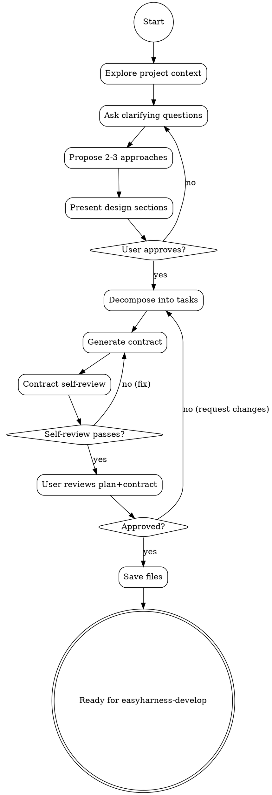

# EasyHarness-Plan: Requirements to Contract Pipeline

## Overview
- Purpose: Turn vague requirements into a plan + contract that easyharness-develop can execute autonomously
- Outputs: plan.md (implementation plan) + contract.md (per-task acceptance criteria)
- Core principle: "Every acceptance criterion must be verifiable without human judgment"
- Flow: explore → design → decompose → contract → self-review

## Prerequisites
- Recommended: superpowers (for brainstorming and writing-plans patterns)
- Install: https://github.com/obra/superpowers
- easyharness-plan works standalone but benefits from these methodologies

## Process Flow


## Phase 1: Requirements Exploration
- Check project context: files, docs, commits, patterns
- Scope assessment: decompose if multiple independent subsystems
- Ask clarifying questions: one per message, prefer multiple choice, focus on purpose/constraints/success criteria/edge cases, ask about testing strategy early
- Propose 2-3 approaches with trade-offs and recommendation
- Key difference: every question pushes toward verifiable outcomes
- Example: Not "What should the UI feel like?" but "Should the form validate on blur or on submit?"

## Phase 2: Task Decomposition
- File structure first: map files to create/modify and responsibilities
- Bite-sized tasks: each = one focused unit (2-5 min for an agent)
- Task format:
  ```
  ### Task N: [Component Name]
  Files: Create/Modify/Test with exact paths
  Complexity: simple | medium | complex
  Dependencies: task numbers or "none"
  Description: 2-3 sentences
  ```
- Complexity classification:
  - simple: single file, clear spec, no integration
  - medium: 2-3 files, some integration, moderate logic
  - complex: multi-file, architecture decisions, complex state

## Phase 3: Contract Generation
For each task, generate machine-verifiable contract.

Contract format per task:
```
## Task N: [name]
### Acceptance Criteria
- [ ] AC-N.1: [Specific verifiable behavior]
### Architectural Constraints (optional but recommended)
- [Structural rules the implementation must follow]
### Test Requirements
- What tests must exist, edge cases, integration points
### Regression Guard
- Existing functionality that must NOT break
### Complexity: simple | medium | complex
```

**Architectural Constraints Writing Rules:**

Inspired by OpenAI's harness practice: enforce invariants, not implementations. Constraints describe WHERE code goes and WHAT boundaries it respects — not HOW to write it.

Good constraints:
- "New service must live in `src/services/`, not in `src/routes/` or `src/components/`"
- "Must not import from UI layer (`src/components/`) into service layer"
- "All new public functions must have JSDoc with @param and @returns"
- "Must reuse existing `src/utils/validate.ts` validators — do not create new validation helpers"

Bad constraints (too vague or too prescriptive):
- "Follow good architecture" — what does "good" mean?
- "Use the Strategy pattern" — prescribes implementation, not boundary
- "Keep it clean" — subjective

**When to include Architectural Constraints:**
- Task creates new files → constrain where they go
- Task modifies shared code → constrain what can depend on it
- Project has ARCHITECTURE.md or layering rules → reference them
- Task is `complex` → almost always needs constraints
- Task is `simple` with one file → usually skip

**AC Writing Rules:**
1. Every AC verifiable by reading code + running tests (no subjective judgment)
2. Concrete values: "returns 400 status" not "returns an error"
3. Include edge cases: "returns empty array when no results"
4. Specify error behavior: "throws InvalidInputError when email is empty"
5. One behavior per AC — if AC contains "and", split it

**Bad ACs (examples):**
- "Works correctly" — what does "correctly" mean?
- "Handles edge cases" — which ones?
- "Good error messages" — what makes them "good"?
- "Responsive design" — at what breakpoints?

**Good ACs (examples):**
- "POST /api/users returns 201 with { id, email, createdAt } when valid email"
- "POST /api/users returns 400 with { error: 'Email required' } when email is empty"
- "User list renders max 20 items per page with 'Load more' button when total > 20"

## Phase 4: Contract Self-Review
Before presenting to user:
1. Verifiability: Can each AC be checked by code + test? Rewrite if requires human judgment
2. Completeness: Do ACs cover the task description? Any missing behavior?
3. Non-overlap: Any duplicate ACs? Merge them.
4. Regression coverage: For tasks modifying existing code, is there a regression guard?
5. Testability: Can you imagine the test for each AC? If not, AC is too vague.

## Output
Save two files:
- `docs/plans/YYYY-MM-DD-<name>.md` — Implementation plan
- `docs/plans/YYYY-MM-DD-<name>-contract.md` — Contract

After saving, prompt user:
> "Plan and contract saved. Please review both files before we proceed:
> - Plan: `<path>`
> - Contract: `<path>`
> Ready to start implementation with easyharness-develop?"

## Common Mistakes
- Writing vague ACs ("works correctly", "handles errors")
- Missing regression guards for modified code
- Over-decomposing simple tasks (one function doesn't need 5 subtasks)
- Under-decomposing complex tasks (multi-file changes in single task)
- Forgetting to ask about testing strategy during exploration

## Quick Reference
| Phase | Output | Key Principle |
|-------|--------|---------------|
| Exploration | Validated requirements | One question at a time, prefer multiple choice |
| Decomposition | Task list with file paths | Bite-sized, TDD-friendly, complexity-tagged |
| Contract | Per-task ACs | Machine-verifiable, no subjective judgment |
| Self-Review | Verified contract | Every AC must be testable |
